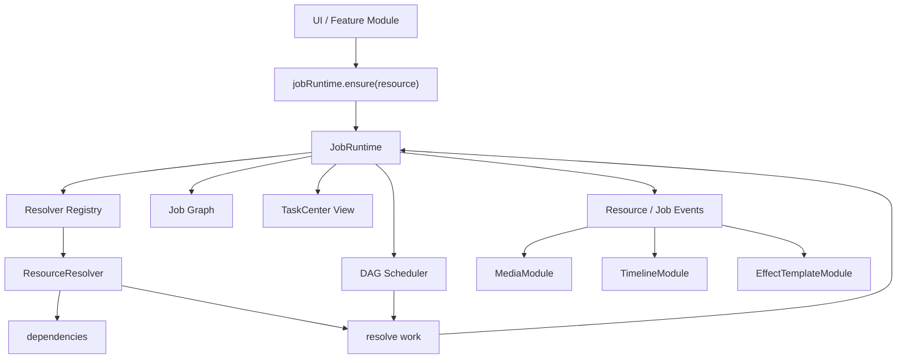

# LightCut Resource-first 任务中心核心设计

## 核心思路

任务中心不直接以“任务提交”为核心，而是以“资源就绪”为核心。

业务方不关心某个流程内部要跑几个步骤，只声明自己需要什么资源：

```ts
await jobRuntime.ensure(MediaReady(mediaId))
await jobRuntime.ensure(AIGeneratedMedia(input))
await jobRuntime.ensure(ASRSubtitles(clipId))
```

系统内部根据资源依赖图执行：

```text
Resource Request -> Resolver -> Dependencies -> Jobs -> TaskCenter View
```

任务中心仍然存在，但它更像执行图的 UI 投影：

```text
JobRuntime 负责依赖图、去重、调度、恢复。
Resolver 负责某类资源如何就绪。
TaskCenter 负责展示、取消、重试、历史。
业务模块负责把资源结果映射回自身状态。
```

### 业务入口节点

业务创建的是大路径里的业务入口节点，而不是把整条内部执行路径手动创建好。

例如时间轴创建 clip 时，业务只需要声明 clip 或 media item 需要达到 ready：

```ts
await jobRuntime.ensure(MediaItemReady(mediaItemId))
```

`MediaItemReady` 是一个聚合资源节点。它内部由 resolver 负责创建和等待子图：

```text
MediaItemReady(mediaItemId)
  -> MediaFileAvailable(mediaItemId)
  -> MediaDecoded(mediaItemId)
  -> ThumbnailReady(mediaItemId)
  -> WaveformReady(mediaItemId)
```

业务模块不需要知道下载、解码、缩略图、波形等内部步骤。`MediaItemReadyResolver` 负责汇总子图结果，并把稳定结果同步回 media item、cache 或项目数据。

长期资源事实不依赖 DAG 保存。`MediaItemReady` 可以根据 media item 当前状态动态构建；如果资源已经 ready，resolver 的 `isSatisfied()` 可以直接返回成功结果。

## 为什么用 DAG

LightCut 的很多异步工作本质不是“跑任务”，而是“让资源达到可用状态”：

- 时间轴预览需要媒体 ready。
- 导出需要所有引用媒体 ready。
- 视觉摘要需要媒体 ready、导出小尺寸素材、上传、请求摘要。
- ASR 需要导出音频、上传音频、远程识别、创建字幕。
- AI 生成需要上传输入、提交远程任务、等待完成、下载结果、解码媒体。

DAG 方式天然解决：

- 同一资源多处请求时自动去重。
- 复杂流程可以拆成可复用依赖。
- 失败、重试、恢复可以按节点处理。
- UI 可以显示整体任务，也可以展开显示子步骤。

## 总体架构



## 核心概念

### ResourceRequest

资源请求描述“我要什么”，而不是“我要跑哪个任务”。

```ts
export interface ResourceRequest<TInput = unknown> {
  type: ResourceType
  key: string
  input: TInput
  policy?: ResourcePolicy
}
```

```ts
export type ResourceType =
  | 'media-ready'
  | 'media-file-available'
  | 'media-decoded'
  | 'uploaded-resource'
  | 'remote-task-completed'
  | 'ai-generated-media'
  | 'asr-subtitles'
  | 'visual-summary'
  | 'effect-template-ready'
  | 'scene-boundaries'
  | 'exported-project'
```

### ResourceKey

`type + key` 是去重和恢复的核心。

```ts
const resourceId = `${request.type}:${request.key}`
```

示例：

```text
media-ready:media_123
media-decoded:media_123
uploaded-resource:sha256_abcd
remote-task-completed:bizyair:request_123
asr-subtitles:clip_123
```

### ResourceState

```ts
export type ResourceStatus =
  | 'idle'
  | 'blocked'
  | 'queued'
  | 'running'
  | 'succeeded'
  | 'failed'
  | 'cancelled'
```

```ts
export interface ResourceNode<TInput = unknown, TResult = unknown> {
  /** 资源节点唯一 ID，通常为 `${type}:${key}` */
  id: string
  /** 资源类型，决定由哪个 ResourceResolver 处理 */
  type: ResourceType
  /** 同类型资源内的稳定去重键 */
  key: string
  /** 创建资源请求时传入的参数，供 resolver 执行和恢复使用 */
  input: TInput
  /** 当前资源状态 */
  status: ResourceStatus

  /** 当前节点依赖的上游资源节点 ID 列表 */
  deps: string[]
  /** 依赖当前节点的下游资源节点 ID 列表 */
  dependents: string[]

  /** 资源成功就绪后的结果 */
  result?: TResult
  /** 资源失败时的错误信息 */
  error?: { message: string; code?: string; retryable?: boolean }
  /** 资源执行进度，范围建议为 0 到 1 */
  progress?: number
  /** 当前执行阶段，例如 uploading、polling、decoding */
  stage?: string
  /** 面向任务中心展示的简短状态文案 */
  message?: string

  /** 调度、持久化、恢复和重试策略 */
  policy: ResourcePolicy

  /** 节点创建时间，使用 ISO 字符串 */
  createdAt: string
  /** 节点最近更新时间，使用 ISO 字符串 */
  updatedAt: string
}
```

### Policy

```ts
export interface ResourcePolicy {
  priority?: number
  queue?: 'remote' | 'local-heavy' | 'export' | 'background'
  persist?: boolean
  restore?: 'resume' | 'recompute' | 'mark-failed' | 'ignore'
  maxRetries?: number
}
```

## Resolver

Resolver 定义某类资源如何变成 ready。

```ts
export interface ResourceResolver<TInput = unknown, TResult = unknown> {
  type: ResourceType

  getKey(input: TInput): string

  isSatisfied?(ctx: ResolveCheckContext<TInput>): Promise<TResult | null>

  getDependencies?(ctx: ResolveContext<TInput>): Promise<ResourceRequest[]>

  resolve(ctx: ResolveContext<TInput>): Promise<TResult>

  cancel?(ctx: ResolveContext<TInput>): Promise<void>

  restore?(node: ResourceNode<TInput, TResult>): Promise<'resume' | 'recompute' | 'fail' | 'ignore'>
}
```

```ts
export interface ResolveContext<TInput = unknown> {
  node: ResourceNode<TInput>
  input: TInput
  signal: AbortSignal

  ensure<T>(request: ResourceRequest): Promise<T>

  update(patch: {
    progress?: number
    stage?: string
    message?: string
  }): void

  emit(event: ResourceDomainEvent): void
}
```

## 示例资源图

### 媒体 ready

```text
MediaReady(mediaId)
  -> MediaFileAvailable(mediaId)
  -> MediaDecoded(mediaId)
```

解释：

- `MediaFileAvailable` 负责本地文件存在，或从远程结果下载。
- `MediaDecoded` 负责 Bunny 解码、duration、缩略图等运行时对象。
- `MediaReady` 是给业务使用的稳定入口。

### AI 生成媒体

```text
AIGeneratedMedia(input)
  -> UploadedResource(input files)
  -> RemoteTaskCompleted(provider, remoteTaskId)
  -> MediaReady(resultMediaId)
```

解释：

- 输入上传可以复用 `UploadedResource`。
- 后端 AI、BizyAir 直连都可以抽象成 `RemoteTaskCompleted`。
- 生成结果最终落到媒体库，并通过 `MediaReady` 解码。

### ASR 字幕

```text
ASRSubtitles(clipId)
  -> ExportedAudio(clipId)
  -> UploadedResource(audio)
  -> RemoteTaskCompleted(volcengine_asr, taskId)
  -> SubtitlesCreated(result)
```

第一版可以把 `SubtitlesCreated` 放在 `ASRSubtitles.resolve()` 内部，后续再拆成独立资源。

### 导出项目

```text
ExportedProject(projectId)
  -> MediaReady(mediaId A)
  -> MediaReady(mediaId B)
  -> EffectTemplateReady(templateId)
  -> EncodeProject(projectId)
```

导出不再自己等待一堆媒体状态，而是声明依赖所有 `MediaReady`。

## JobRuntime API

```ts
class JobRuntime {
  ensure<T>(request: ResourceRequest): Promise<T>
  cancel(resourceId: string): Promise<boolean>
  retry(resourceId: string): Promise<boolean>
  getNode(resourceId: string): ResourceNode | undefined
}
```

便捷 API：

```ts
await jobRuntime.ensureMediaReady(mediaId)
await jobRuntime.ensureAIGeneratedMedia(input)
```

## 调度规则

DAG Scheduler 的规则：

- 节点所有依赖成功后才可运行。
- 任一依赖失败，当前节点进入 `blocked` 或 `failed`。
- 相同 `resourceId` 只保留一个节点，请求方共享结果。
- 后来的请求可以提高 priority。
- 取消父节点时，取消只由它独占的子节点；共享子节点不能被误取消。
- 重试节点时，可选择只重试失败节点，或连同下游节点一起重算。

并发队列：

```text
remote       AI、ASR、视觉摘要、远程轮询
local-heavy  媒体解码、智能分镜
export       项目导出
background   模板下载、后台摘要
```

## 运行态 DAG 生命周期

DAG 是运行态调度结构，不是长期资源数据库。

长期资源状态应由业务域对象或缓存保存，例如：

```text
mediaItem.mediaStatus
mediaItem.localPath
mediaItem.duration
mediaItem.thumbnail
mediaItem.waveform
project metadata
cache manifest
```

ResourceNode 只保存本次执行所需的运行态信息：

```text
当前状态
依赖边
等待者
取消控制器
进度
错误
短期 result
```

每次业务调用 `ensure(root)` 可以视为一次 root 路径执行。root 跑完后，Runtime 递归检查这条路径上的节点是否可以释放：

```text
release(root)
  -> root external reference - 1
  -> 如果 root 已结束且没有引用，则释放 root
  -> 断开 root 到 deps 的边
  -> 递归检查 deps 是否也可以释放
```

节点释放条件：

```ts
function canRelease(node: ResourceNode) {
  return isTerminal(node.status)
    && node.externalRefCount === 0
    && node.waiterCount === 0
    && node.dependents.length === 0
}
```

共享依赖不能被单条路径误释放：

```text
TimelineClipReady(clipA) -> MediaItemReady(media_1)
TimelineClipReady(clipB) -> MediaItemReady(media_1)
```

当 `clipA` 的路径完成时，只能断开 `clipA -> MediaItemReady(media_1)` 这条边。只有没有其他 dependents、没有外部等待者，并且节点已进入终态时，`MediaItemReady(media_1)` 才能被释放。

## TaskCenter View

TaskCenter 是 Job Graph 的 UI 投影，而不是执行真相本身。

一个 UI 任务可以对应：

- 单个 ResourceNode。
- 一个父节点和它的依赖子图。
- 一组同类后台节点。

```ts
export interface TaskView {
  id: string
  title: string
  status: ResourceStatus
  progress?: number
  message?: string
  rootResourceId: string
  childResourceIds: string[]
  actions: {
    canCancel: boolean
    canRetry: boolean
    canRevealSource: boolean
  }
}
```

UI 展示任务，底层仍通过 `JobRuntime.cancel(rootResourceId)` 和 `JobRuntime.retry(rootResourceId)` 操作资源图。

MVP 阶段 `canRevealSource` 可以先固定为 `false`，等引入业务绑定后再支持定位来源。

## 媒体和 Timeline 状态同步

Runtime 不直接修改 timeline clip。

MVP 阶段，Runtime 不记录资源和业务对象的映射关系。业务模块在调用 `ensure(...)` 时自己保留上下文，通过 `await` 结果或订阅特定 `resourceId` 的事件同步 UI。

它发布资源事件：

```ts
export type ResourceEvent =
  | { type: 'resource:created'; node: ResourceNode }
  | { type: 'resource:updated'; node: ResourceNode }
  | { type: 'resource:succeeded'; node: ResourceNode }
  | { type: 'resource:failed'; node: ResourceNode }
  | { type: 'resource:cancelled'; node: ResourceNode }
```

TimelineModule 示例：

```ts
timelineModule.markClipLoading(clipId)

try {
  await jobRuntime.ensureMediaReady(mediaId)
  timelineModule.markClipReady(clipId)
} catch (error) {
  timelineModule.markClipError(clipId, error)
}
```

也可以由业务模块自行维护映射：

```ts
const request = MediaReady(mediaId)
const resourceId = `${request.type}:${request.key}`

timelineResourceMap.set(clipId, resourceId)
```

然后按 `resourceId` 订阅状态：

```text
media-ready queued/running -> timelineItem.timelineStatus = loading
media-ready succeeded      -> timelineItem.timelineStatus = ready
media-ready failed         -> timelineItem.timelineStatus = error
media-ready cancelled      -> timelineItem.timelineStatus = cancelled
```

MediaModule 同理按自己维护的 `mediaId -> resourceId` 映射同步状态：

```text
media-ready queued/running -> mediaItem.mediaStatus = pending/asyncprocessing/decoding
media-ready succeeded      -> mediaItem.mediaStatus = ready
media-ready failed         -> mediaItem.mediaStatus = error
media-ready cancelled      -> mediaItem.mediaStatus = cancelled
```

## 持久化与恢复

持久化 ResourceNode，而不是持久化运行时对象。

可持久化：

- resource type/key/input/status。
- remote task id 和 provider。
- result metadata。
- error 信息。

不可持久化：

- AbortController。
- File、Blob、Bunny runtime object。
- API Key。

恢复策略：

- `resume`: 重新连接进度流或重新轮询远程任务。
- `recompute`: 从资源依赖重新计算。
- `mark-failed`: 本地导出、智能分镜等无法恢复的运行中节点标记失败。
- `ignore`: 临时资源不恢复。

## 后续扩展：业务绑定

如果后续 TaskCenter 需要“定位来源”、按 clip / project / directory 过滤任务，或应用重启后恢复资源和业务对象的 UI 映射，可以再引入可选的 `bindings` 元数据。

`bindings` 不参与资源去重、依赖解析和调度，只表达资源和业务对象的关联。

```ts
export type ResourceBinding =
  | { type: 'media-item'; id: string }
  | { type: 'timeline-item'; id: string }
  | { type: 'directory'; id: string }
  | { type: 'effect-template'; id: string }
  | { type: 'project'; id: string }
```

扩展后的接口可以是：

```ts
export interface ResourceRequest<TInput = unknown> {
  type: ResourceType
  key: string
  input: TInput
  policy?: ResourcePolicy
  bindings?: ResourceBinding[]
}

class JobRuntime {
  getNodesByBinding(binding: ResourceBinding): ResourceNode[]
}
```

## 迁移路径

### 阶段一：Runtime 骨架

- 新增 `JobRuntime`、`ResourceNode`、`ResourceResolver`、DAG Scheduler。
- 新增 TaskCenter View，将 ResourceNode 投影成任务列表。

### 阶段二：媒体 ready

- 实现 `MediaReadyResolver`、`MediaFileAvailableResolver`、`MediaDecodedResolver`。
- 引入 `ensureMediaReady(mediaId)`。
- Timeline clip 状态从 watch 迁移到资源事件。

### 阶段三：远程生成

- 实现 AI / BizyAir / ASR 相关 resolver。
- 复用现有上传、提交、流监听、轮询、下载逻辑。
- 将现有 Processor 的队列职责迁移到 JobRuntime。

### 阶段四：编辑器长任务

- 接入导出、智能分镜、视觉摘要、效果模板下载。
- 导出依赖显式声明为一组 `MediaReady` 和 `EffectTemplateReady`。

## 推荐目录

```text
src/core/jobs/
  JobRuntime.ts
  ResourceTypes.ts
  ResourceResolver.ts
  DagScheduler.ts
  TaskViewAdapter.ts
  resolvers/
    MediaReadyResolver.ts
    MediaFileAvailableResolver.ts
    MediaDecodedResolver.ts
    UploadedResourceResolver.ts
    RemoteTaskCompletedResolver.ts
    AIGeneratedMediaResolver.ts
    ASRSubtitlesResolver.ts
    ExportedProjectResolver.ts
    EffectTemplateReadyResolver.ts
```

## 最终形态

业务代码声明资源需求：

```ts
await jobRuntime.ensureMediaReady(mediaId)
await jobRuntime.ensureAIGeneratedMedia(input)
await jobRuntime.ensureASRSubtitles(clipId)
```

JobRuntime 负责依赖图、调度、去重、恢复。

TaskCenter 负责把这张图展示给用户，并提供取消、重试等操作；定位来源可以在后续引入业务绑定后扩展。
